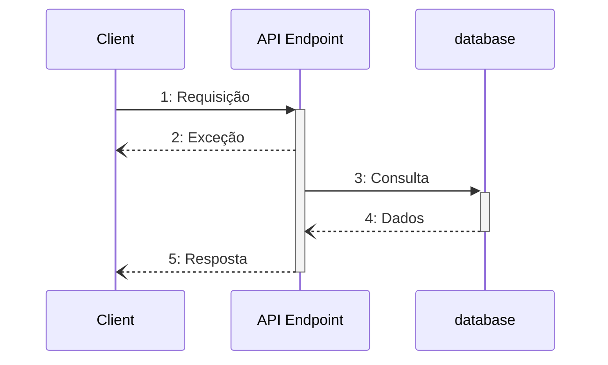

# Endpoint

O endpoint é o nivel da API responsavel por estabelecer um canal de comunicação com outros sistemas, atraves de `solicitações` e `responstas`, comumente utilizando os métodos de requisição HTTP `GET`, `POST`, `PUT`, `DELETE`, `HEAD`, `TRACE`, `OPTIONS`, `CONNECT` e `PATCH`. saiba mais em [mozila.org](https://developer.mozilla.org/pt-BR/docs/Web/HTTP/Methods)

1. O cliente solicita para a API Endpoint atravez de um methodo de requisição HTTP.
2. A API Endpoint Analiza essa solicitaçao, caso não seja uma ação valida retorna uma resposta de exceção.
3. Caso passe pela etapa 2, a API realiza uma consulta na base de dados da aplicaçao.
4. Nesta etapa a API analiza e estrutura os dados solicitados, no padrao adequado.
5. Retorna os dados solicitados.

---
